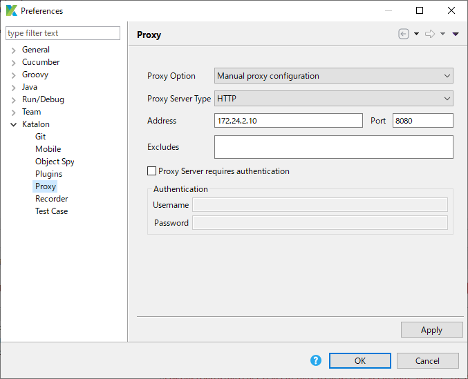

com.kms.katalon.core.util.internal.ProxyUtil.getProxy() threw NullPointerException; ver7.1.2
====

I have a simple test case scrit [Test Cases/TC1](Scripts/TC1/Script1576827099254.groovy).

I have "Manual configuration setting" applied



When I ran the script in Katalon Studio ver 7.1.2, it threw an Exception:

```
12-20-2019 04:34:08 午後 Test Cases/TC1

Elapsed time: 1.158s

Test Cases/TC1 FAILED.
Reason:
com.kms.katalon.core.exception.StepFailedException: Unable to open browser with url: ''
	at com.kms.katalon.core.webui.keyword.internal.WebUIKeywordMain.stepFailed(WebUIKeywordMain.groovy:64)
	at com.kms.katalon.core.webui.keyword.internal.WebUIKeywordMain.runKeyword(WebUIKeywordMain.groovy:26)
	at com.kms.katalon.core.webui.keyword.builtin.OpenBrowserKeyword.openBrowser(OpenBrowserKeyword.groovy:81)
	at com.kms.katalon.core.webui.keyword.builtin.OpenBrowserKeyword.execute(OpenBrowserKeyword.groovy:67)
	at com.kms.katalon.core.keyword.internal.KeywordExecutor.executeKeywordForPlatform(KeywordExecutor.groovy:72)
	at com.kms.katalon.core.webui.keyword.WebUiBuiltInKeywords.openBrowser(WebUiBuiltInKeywords.groovy:60)
	at com.kms.katalon.core.webui.keyword.WebUiBuiltInKeywords$openBrowser.call(Unknown Source)
	at TC1.run(TC1:3)
	at com.kms.katalon.core.main.ScriptEngine.run(ScriptEngine.java:194)
	at com.kms.katalon.core.main.ScriptEngine.runScriptAsRawText(ScriptEngine.java:119)
	at com.kms.katalon.core.main.TestCaseExecutor.runScript(TestCaseExecutor.java:337)
	at com.kms.katalon.core.main.TestCaseExecutor.doExecute(TestCaseExecutor.java:328)
	at com.kms.katalon.core.main.TestCaseExecutor.processExecutionPhase(TestCaseExecutor.java:307)
	at com.kms.katalon.core.main.TestCaseExecutor.accessMainPhase(TestCaseExecutor.java:299)
	at com.kms.katalon.core.main.TestCaseExecutor.execute(TestCaseExecutor.java:233)
	at com.kms.katalon.core.main.TestCaseMain.runTestCase(TestCaseMain.java:114)
	at com.kms.katalon.core.main.TestCaseMain.runTestCase(TestCaseMain.java:105)
	at com.kms.katalon.core.main.TestCaseMain$runTestCase$0.call(Unknown Source)
	at TempTestCase1576827246305.run(TempTestCase1576827246305.groovy:23)
Caused by: java.lang.NullPointerException
	at com.kms.katalon.core.util.internal.ProxyUtil.getProxy(ProxyUtil.java:80)
	at com.kms.katalon.core.webui.util.WebDriverProxyUtil.getSeleniumProxy(WebDriverProxyUtil.java:90)
	at com.kms.katalon.core.webui.driver.DriverFactory.getDefaultProxy(DriverFactory.java:403)
	at com.kms.katalon.core.webui.driver.DriverFactory.createNewFirefoxDriver(DriverFactory.java:580)
	at com.kms.katalon.core.webui.driver.DriverFactory.startNewBrowser(DriverFactory.java:308)
	at com.kms.katalon.core.webui.driver.DriverFactory.openWebDriver(DriverFactory.java:208)
	at com.kms.katalon.core.webui.keyword.builtin.OpenBrowserKeyword$_openBrowser_closure1.doCall(OpenBrowserKeyword.groovy:74)
	at com.kms.katalon.core.webui.keyword.builtin.OpenBrowserKeyword$_openBrowser_closure1.call(OpenBrowserKeyword.groovy)
	at com.kms.katalon.core.webui.keyword.internal.WebUIKeywordMain.runKeyword(WebUIKeywordMain.groovy:20)
	... 17 more
```

The Katalon .log is attached [here](docs/.log), which has nothing interesting.


I also tried running the same TC1 in Katalon Studio 7.1.0. I ran successful. No NullPointerException was raised.

